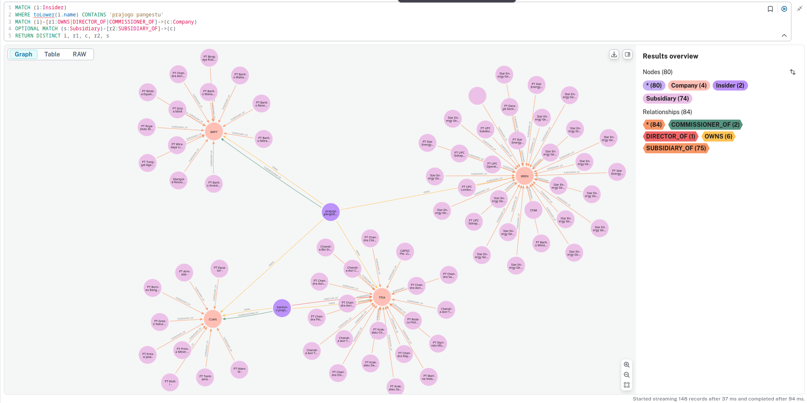

# IDX-BEI Data & Quantitative Analysis Toolkit

Toolkit for scraping, storing, and analyzing data from the Indonesia Stock Exchange (IDX / Bursa Efek Indonesia). Covers market data, company fundamentals, corporate actions, and broker flows — with time-series storage, Parquet export, and graph analysis pipelines.



## Quick Start

```bash
git clone https://github.com/yourusername/idx-bei.git
cd idx-bei
uv sync
```

### Scrape & Pipeline Commands

```bash
# 1. Scrape all snapshot datasets (company profiles, financial ratios, corporate actions, brokers)
uv run idx all

# 2. Backfill full-universe company boards, shareholders & dividends (952 tickers)
uv run idx company --all-details

# 3. Daily ingestion (today's OHLCV, broker summary & index flow)
uv run idx daily

# 4. Historical OHLCV backfill (for backtesting)
uv run idx backfill --start 20260101 --end 20260807

# 5. Export all time-series and snapshots to Parquet
uv run idx parquet
```

### Daily Decision-Support Signals

```bash
# Generate daily signal briefing (writes Markdown + JSON into data/briefings/)
uv run idx signals

# Optional: broadcast briefing summary to Discord/Slack/Telegram webhook
uv run idx signals --webhook-url "https://discord.com/api/webhooks/..."
```

Runs five quantitative decision-support screens over Parquet exports:
- **Foreign Flow Radar** — net foreign buying/selling as % of free float (accumulate/distribute)
- **Audit Risk Shield** — stocks with non-clean audit opinions (`WDP`/`TMP`/`TL`)
- **Dilution Watch** — recent private placements, warrants, and capital reductions
- **Sharia Value Screen** — sharia-flagged, PER < 12, ROE ≥ 12%, DER ≤ 2
- **Pasar Nego Crossing Radar** — stealth off-market block crossings (value > Rp25B, nego share > 75%)

### Interactive Dashboard & AI Assistant (MCP)

```bash
# Launch Smart Money & Network Alpha visual dashboard
uv run idx dashboard --port 8080

# Start Model Context Protocol (MCP) Server for Claude, Cursor, Antigravity
uv run idx mcp
```

The MCP server exposes standard JSON-RPC tools (`idx_get_signals`, `idx_query_stock`, `idx_get_company_profile`, `idx_screen_sharia_value`, `idx_get_super_insiders`) for AI assistants.

## Repository Structure

```text
idx-bei/
├── pyproject.toml                 # Root UV workspace configuration
├── uv.lock                        # Consolidated workspace lockfile
├── python/                        # Python package & scripts
│   ├── src/idx/                   # Core package (src-layout)
│   │   ├── core/                  # HTTP client, DuckDB query layer, KSEI ownership engine
│   │   ├── scrapers/              # Domain scrapers (company, trading, corporate, financial, news)
│   │   ├── pipelines/             # Parquet export, daily ingestion, analysis
│   │   ├── mcp/                   # Model Context Protocol (MCP) server
│   │   ├── signals.py             # Decision-support screens & briefing builder
│   │   └── cli.py                 # CLI implementation
│   ├── cli.py                     # CLI launcher
│   ├── tests/                     # Pytest suite (65 passing unit tests)
│   ├── neo4j_ingest.py            # Neo4j graph ingestion script
│   ├── neo4j.ipynb                # Graph analysis notebook
│   └── pyproject.toml             # Package config (uv/setuptools)
├── data/                          # Generated datasets (gitignored)
│   ├── timeseries/                # Historical OHLCV, broker, index partitions
│   ├── parquet/                   # Columnar exports for fast analytics
│   └── briefings/                 # Daily signal briefings (md + json)
├── .github/workflows/             # CI testing (tests.yml)
├── docker-compose/                # Neo4j & PostgreSQL service configs
└── dashboard/index.html           # Smart Money & Network Alpha visual dashboard
```

## Testing & Code Quality

```bash
# Run automated pytest suite (65 unit tests)
uv run pytest python/tests

# Run Ruff linter and formatter
uv run ruff check python/src python/tests
uv run ruff format python/src python/tests
```

## Neo4j Knowledge Graph Ingestion

```bash
# 1. Start Neo4j container
docker compose up -d

# 2. Ingest full 952-company network (12,000+ insiders, 5,400+ subsidiaries)
uv run python/neo4j_ingest.py

# 3. Open Neo4j Browser UI
# URL: http://localhost:7474 (user: neo4j, password: password)
```

## Tech Stack

| Layer | Tools |
|-------|-------|
| Language | Python 3.13+ |
| Package Manager | [uv](https://github.com/astral-sh/uv) (root workspace) |
| HTTP Client | `curl_cffi` (browser impersonation, Cloudflare bypass) |
| Query & Storage | DuckDB, Parquet (`pyarrow`), JSON |
| Databases | Neo4j (graph), PostgreSQL (relational) |
| Analytics & ML | `pandas`, `scikit-learn`, `matplotlib`, `seaborn` |
| AI Assistant Protocol | Model Context Protocol (MCP stdio) |
| Infrastructure | Docker Compose |

## API Coverage

| Endpoint | Data | Status |
|----------|------|--------|
| `GetStockSummary` | Daily OHLCV, foreign flow, bid/offer | 🟢 |
| `GetBrokerSummary` | Broker transaction volume & value | 🟢 |
| `GetIndexSummary` | IHSG, LQ45, sectoral indices | 🟢 |
| `GetCompanyProfiles` | Listed company directory | 🟢 |
| `GetCompanyProfilesDetail` | Board, shareholders, subsidiaries | 🟢 |
| `GetApiDataPaginated` | P/E, P/B, ROA, ROE, EPS, NPM | 🟢 |
| `GetIssuedHistory` | Corporate actions (15 categories) | 🟢 |
| `GetBrokerSearch` | Exchange member directory | 🟢 |
| `GetNewsSearch` | Market news & headlines | 🟢 |
| `GetAllAnnouncement` | Company disclosures & PDF filings | 🟢 |

See [API_VERIFICATION_SPEC.md](python/API_VERIFICATION_SPEC.md) for full endpoint documentation.

## License

MIT — see [LICENSE](LICENSE).

---
*Disclaimer: For educational and research purposes only. Comply with IDX terms of service.*
